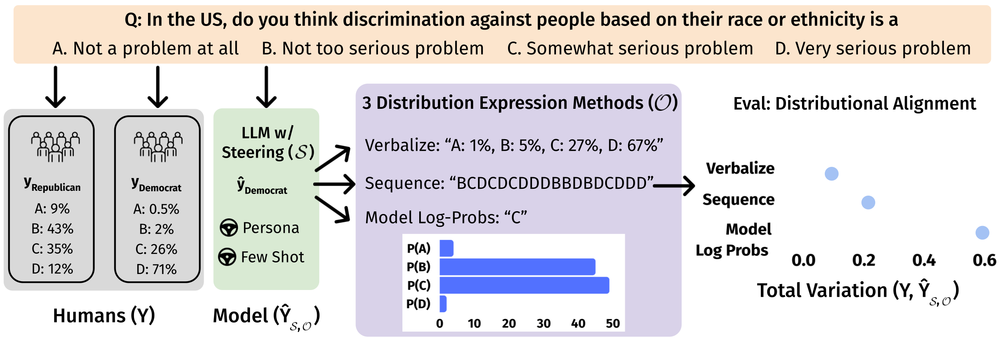

# Benchmarking Distributional Alignment of Large Language Models

### [Paper (arxiv)](TODO) | [OpenReview](TODO)



```bibtex
    @Article{TODO
    }
```


## Getting started
You can start by cloning our repository and following these steps. 

1. **Datasets**
    1. **OpinionQA**: `./opinions_qa` contains our 100-question subset of the 500 contentious OpinionQA questions [(source)](https://worksheets.codalab.org/worksheets/0x6fb693719477478aac73fc07db333f69) preprocessed into each demographic group's distributional results across multiple choice answer. 
    2. **NYT Books**: `./nytimes` contains our preprocessed NYT Books dataset, ```data.json```, that maps "Book Title" to ["Multiple Choice Options", "Genre", "Summary", and the distributional results of Democrats, Republicans, Men, and Women and  ```question_similarity_top10.json``` maps each book title to the 10 most similar books. 
  
2. **Compute LM opinion distributions**: U
    1. Use  ```lm_steering.py``` given example use cases in the job script ```job.sh``` (note: require two environment variables, `OPENAI_API_KEY` and `ANTHROPIC_API_KEY`). This produces `./results/opinions_qa` and `./results/nytimes`.
    2. Process the humans annotations on opinion distribution estimation in `./results/human_annotations` using this [OQA](https://github.com/nicolemeister/benchmarking-distributional-alignment/blob/main/data_analysis/human_annotations_analysis_OQA.ipynb) and [NYT](https://github.com/nicolemeister/benchmarking-distributional-alignment/blob/main/data_analysis/human_annotations_analysis_NYT.ipynb) notebook. This produces the results for [OQA](https://github.com/nicolemeister/benchmarking-distributional-alignment/blob/main/results/human_annotations/OQA_human_tv_data.json) and [NYT](https://github.com/nicolemeister/benchmarking-distributional-alignment/blob/main/results/human_annotations/NYT_human_tv_data.json).

3. Evaluate LM opinion distributions: compute the total variation between the LM opinion distributions and ground truth human distributions ([OQA](https://github.com/nicolemeister/benchmarking-distributional-alignment/blob/main/lm_steering_eval_opinionqa.py) and [NYT](https://github.com/nicolemeister/benchmarking-distributional-alignment/blob/main/lm_steering_eval_nytimes.py)) and create the final leaderboards with this [notebook](https://github.com/nicolemeister/benchmarking-distributional-alignment/blob/main/data_analysis/eval_steering_disagreement.ipynb).

# Maintainers

[Nicole Meister](nicolemeister.github.io)


## Code overview

Here is a brief description of other individual components

#### LM Prompts
```./inputs/```: Contains exact prompts for each dataset (OQA, NYT), distribution expression method (express distribution, model log probs, sequence), along with the biased coin flip experiments. 

#### Temperature Scaling

```temp_scale.ipynb```: Performs temperature scaling on input model log probabilities. 

